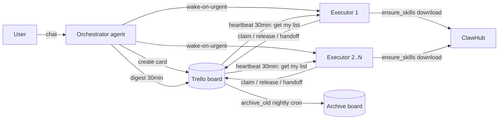
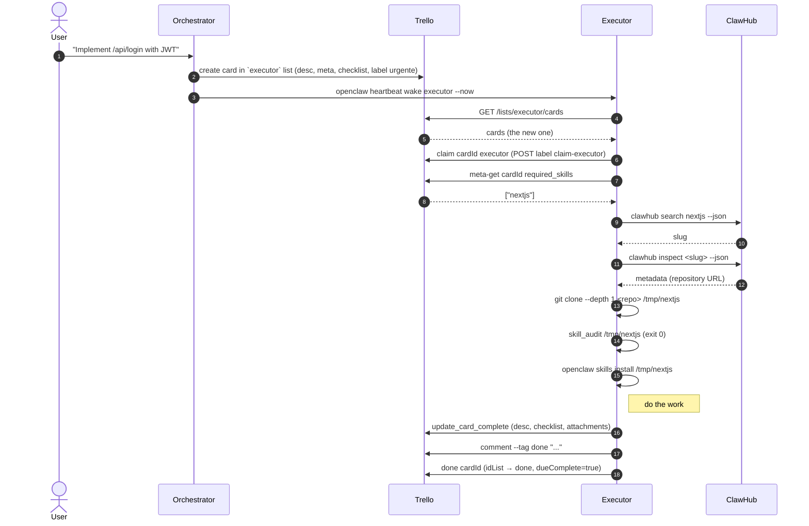

# Architecture

The plugin is structured in four cooperating layers. The diagrams render directly on GitHub.

## Component view



## Sequence: one card, end to end



## Layers

```
L3 — Per-agent workspace (~/.openclaw/workspace-<agent>/)
     Standard OpenClaw files: AGENTS.md, SOUL.md, USER.md, IDENTITY.md,
     TOOLS.md, HEARTBEAT.md, MEMORY.md, memory/YYYY-MM-DD.md.

L2 — Plugin (~/.openclaw/plugins/trello-mission-control/)
     openclaw.plugin.json declares hooks + config schema.
     index.ts registers onGatewayStart, onSessionStart, onSessionStop.

L1 — Skill (~/.openclaw/skills/trello-mission-control/)
     SKILL.md with YAML frontmatter.
     scripts/ holds the Python CLI.
     references/ holds the docs, snippets, agent templates.

L0 — Global config
     ~/.openclaw/openclaw.json     — agents.list with skills+tools allow.
     ~/.openclaw/exec-approvals.json — per-agent allowlist patterns.
```

## Why these specific choices

- **Plugin vs skill-only**: a plugin can bundle hooks and config schema. The skill alone could not register `onSessionStop` to release claims when an agent session dies.
- **Label-based claim**: the Trello API has no compare-and-swap. A label is visible in the UI, simple to query, and the race window (read labels → POST label) is ~200ms — small enough that two agents almost never race on the same card.
- **One nested `/boards/{id}/cards` call**: replaces `pipeline-status` and `digest`'s previous N+1. Saves rate-limit budget and reduces orchestrator latency.
- **JSON meta block in `desc`**: Trello Free has no custom fields. Putting structured metadata in a comment-style block keeps the description readable and parseable.
- **Static skill audit**: a sandbox would be more thorough but adds dependencies and complexity. A static scan catches the obvious dangerous patterns and is good enough as a first filter; the user is the final arbiter.
- **Tokenjuice on by default**: every CLI call returns a few-line summary, but `pipeline-status` or `digest` on a busy board can produce a lot. Tokenjuice compacts it without changing exit codes or stderr.
- **Per-token rate budget**: each agent should authenticate with its own token so the per-token 100 req / 10 s limit applies independently. Sharing a token is the most common rate-limit footgun.

## Where things live in this repo

```
trello-mission-control/
├── openclaw.plugin.json    # plugin manifest
├── package.json            # npm metadata + version
├── index.ts                # plugin entry: hook registration
├── SKILL.md                # protocol document loaded into every agent session
├── scripts/                # CLI (Python 3 stdlib only)
│   ├── trello_task.py      # main CLI
│   ├── digest.py           # 1-call orchestrator summary
│   ├── archive_old.py      # nightly archive cron payload
│   ├── wake_on_urgent.py   # openclaw heartbeat wake wrapper
│   ├── setup_labels.py     # idempotent label setup (also onGatewayStart hook)
│   ├── release_my_claims.py# onSessionStop hook payload
│   ├── skill_audit.py      # static scan for clawhub skills
│   ├── ensure_skills.py    # reads required_skills, installs missing
│   ├── attach_dir.py       # gzip a dir, attach (10 MB cap)
│   └── update_card_complete.py  # card hygiene helper
├── references/             # human-readable design + snippets + templates
├── tests/                  # unittest suite + smoke.sh
└── docs/                   # docs entry points (quickstart, troubleshooting, this)
```
